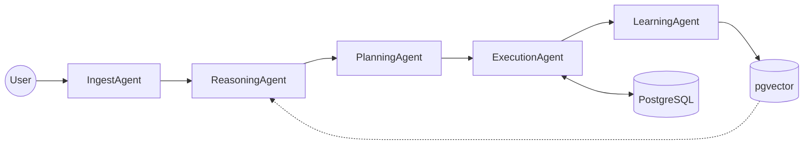

# Autonomous CRM Intelligence System (Agentic AI)

Chào mừng bạn đến với dự án **Agentic CRM Intelligence System**. Đây là một hệ thống AI Agent đa tầng được thiết kế để cung cấp khả năng truy vấn và phân tích dữ liệu CRM một cách thông minh, an toàn và có khả năng tự học.

## 🚀 Quy trình hoạt động (Agent Pipeline)

## 🚀 Tính năng nổi bật
- **Kiến trúc 5 tầng Agent**: Ingest, Reasoning, Planning, Execution, Learning.
- **Tư duy CoT (Chain-of-Thought)**: AI giải thích cách suy luận trước khi hành động.
- **Tự sửa lỗi (Self-Healing)**: Tự động sửa lỗi SQL và thử lại.
- **Bộ nhớ dài hạn (pgvector)**: Ghi nhớ các mẫu thành công để tối ưu hóa chi phí và tốc độ.
- **Bảo mật tối đa**: Sử dụng giao thức MCP và RBAC để bảo vệ dữ liệu.

## 📂 Cấu trúc Dự án
Xem sơ đồ trực quan tại: [tasks/project_structure.md](tasks/project_structure.md)

- `plans/`: Chứa các tài liệu chi tiết cho từng phase phát triển.
- `tasks/`: Chứa danh sách các công việc cụ thể cho từng phase và mô tả hệ thống.
- `core/`: Mã nguồn cốt lõi của hệ thống Agent.
- `apps/`: Giao diện người dùng (Streamlit) và API Backend (Flask).
- `data/`: Các script migration và định nghĩa schema.

## 🛠️ Công nghệ sử dụng
- **LangGraph**: Điều phối Agent.
- **Groq (Llama3)**: Suy luận và thực thi nhanh.
- **Gemini (Flash)**: Phân tích đầu vào và lập kế hoạch.
- **PostgreSQL + pgvector**: Lưu trữ dữ liệu và bộ nhớ ngữ nghĩa.
- **Flask & Streamlit**: API và giao diện người dùng.

## 📖 Tài liệu hướng dẫn
1. [Mô tả hệ thống](tasks/system_description.md)
2. [Kiến trúc hệ thống](tasks/system_architecture.md)
3. [Danh sách công việc (To-Do)](tasks/)

## 📝 Roadmap Phát triển
Hệ thống được phát triển qua 9 Phase:
- Phase 1: Kiến trúc & Thông số kỹ thuật.
- Phase 2: Di chuyển Database & Tối ưu Schema.
- Phase 3: Khởi tạo Project & Giao diện Traceable.
- Phase 4: Công cụ gọi & Kiến trúc bảo mật.
- Phase 5: Tầng IngestAgent (Gatekeeper).
- Phase 6: Tầng ReasoningAgent (Thinker).
- Phase 7: Tầng PlanningAgent (BabyAGI).
- Phase 8: Tầng ExecutionAgent (Doer).
- Phase 9: Tầng LearningAgent (Scholar).
