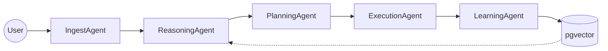

# 🚀 Autonomous CRM Intelligence System (Agentic AI)

Chào mừng bạn đến với dự án **Agentic CRM Intelligence System**. Đây là một hệ thống AI Agent đa tầng được thiết kế để cung cấp khả năng truy vấn và phân tích dữ liệu CRM một cách thông minh, an toàn và có khả năng tự học.

---

## 📖 Tài liệu Hướng dẫn (Documentation)

Hệ thống được thiết kế bài bản với bộ tài liệu chi tiết giúp bạn nhanh chóng làm quen:

| Tài liệu | Đối tượng | Nội dung chính |
|---|---|---|
| 🌟 [**Tổng quan Hệ thống**](docs/system_overview.md) | Mọi người | Tầm nhìn, tính năng và cách AI làm việc (Dễ hiểu). |
| 🏗️ [**Kiến trúc & Luồng xử lý**](docs/architecture_flow.md) | Kỹ thuật | Sơ đồ Mermaid, Cấu trúc thư mục và Luồng Agent. |
| 🛠️ [**Lộ trình Công nghệ**](docs/tech_stack.md) | Kỹ thuật | Chi tiết các thư viện & LLMs sử dụng theo từng Phase. |

---

## 🧩 Quy trình hoạt động (Agent Pipeline)
Hệ thống hoạt động dựa trên 5 tầng Agent phối hợp nhịp nhàng:

---

## 🚀 Tính năng nổi bật
- **Traceable UI**: Xem lộ trình tư duy (Chain-of-Thought) của Agent theo thời gian thực.
- **Context Awareness**: Hiểu ngữ cảnh hội thoại nhiều lượt (giải quyết đại từ "nó", "họ"...).
- **Secure Execution**: Thực thi SQL an toàn thông qua lớp bảo mật RBAC và Tool Layer.
- **Self-Learning**: Ghi nhớ các mẫu thành công để tối ưu hóa chi phí và tốc độ.

---

## 📂 Cấu trúc Dự án (Sơ lược)
- `apps/`: Giao diện người dùng (Streamlit) và API Backend (Flask).
- `core/`: Trái tim của hệ thống (Graph, Agents, Tools).
- `docs/`: Tài liệu hướng dẫn và kiến trúc.
- `plans/`: Kế hoạch chi tiết cho từng giai đoạn (Phase 1-10).
- `tasks/`: Danh sách các công việc cần làm (Checklist).

---

## 📝 Roadmap Phát triển
Hệ thống được phát triển qua 10 Phase chuyên sâu:
- **Phase 1-21**: Đã hoàn thành toàn bộ hệ thống (Hoàn thành ✅).
  - Tích hợp Multi-Agent, Resilience, RAG Nâng cao, MCP Tools và Observability Cockpit.

---
*Phát triển bởi đội ngũ chuyên gia AI Agent.*
