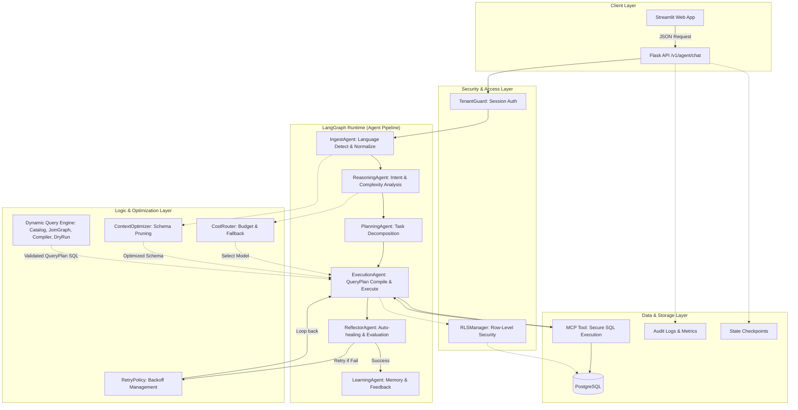

# Kiến Trúc Hệ Thống Agentic AI (v2)

Tài liệu này mô tả chi tiết kiến trúc kỹ thuật của dự án Agentic AI. Hệ thống được thiết kế theo dạng **Modular Pipeline** kết hợp tư tưởng của tác tử thông minh (Agentic Workflow), cho phép xử lý các truy vấn ngôn ngữ tự nhiên thành câu lệnh SQL phức tạp, thực thi an toàn và trả về báo cáo theo ngôn ngữ người dùng yêu cầu.

---

## 1. Biểu Đồ Kiến Trúc Tổng Quan (Architecture Diagram)

Dưới đây là sơ đồ luồng dữ liệu (Data Flow) và tương tác giữa các thành phần cốt lõi trong hệ thống:

---

## 2. Chi Tiết Các Tầng (Layers & Modules)

### 2.1 Client Layer
- **Streamlit Web App** (`apps/web/streamlit_app.py`, `1_observability_cockpit.py`): Giao diện người dùng. Có 2 chức năng chính: Chatbot cho người dùng cuối và Dashboard Observability cho SysAdmin/DevOps.
- **Flask API** (`apps/api/app.py`): Tiếp nhận các request HTTP RESTful, đóng gói request và gọi vào LangGraph Runtime.

### 2.2 Security & Access Layer
- **TenantGuard** (`core/utils/logic/tenant_guard.py`): Đảm bảo các request từ API đều phải chứa `session_id` (Tenant ID) hợp lệ, phân lập các luồng request để tránh lọt dữ liệu.
- **RLSManager** (`core/utils/logic/rls_manager.py`): Quản lý tự động các policy Row-Level Security (RLS) của Postgres. Ngay cả khi Agent bị prompt-injection để sinh SQL truy vấn toàn bộ dữ liệu, RLS của database sẽ chặn truy vấn từ những dòng không thuộc về Tenant hiện tại.

### 2.3 LangGraph Runtime (Core Agent Pipeline)
Được điều phối bởi `LangGraphRuntime` (`core/graph/langgraph_runtime.py`), dữ liệu đi qua 6 Agent nối tiếp nhau:
1. **IngestAgent**: Làm sạch dữ liệu, nhận diện ngôn ngữ (`langdetect`) để lưu vào trạng thái `detected_language`.
2. **ReasoningAgent**: Phân tích Business Intent (ý định nghiệp vụ), độ khó (Complexity). Trả về JSON có cấu trúc (Pydantic Schema) bằng thư viện `LiteLLM`.
3. **PlanningAgent**: Phân rã bài toán thành nhiều Task con nhỏ hơn. Xác định rõ Task nào chạy trước, Task nào chạy sau.
4. **ExecutionAgent**: Chuyển Task thành `QueryPlan` có cấu trúc khi có thể, validate bảng/cột qua catalog, compile thành SQL an toàn, rồi mới thực thi qua MCP Tool. Nhánh LLM raw SQL chỉ còn là fallback khi dynamic compiler không đủ thông tin.
5. **ReflectorAgent**: Nhận kết quả từ DB (hoặc thông báo lỗi). Dùng LLM đánh giá xem kết quả có đúng kỳ vọng không. Nếu lỗi (ví dụ: thiếu cột, sai cú pháp), Agent tự động kích hoạt **RetryPolicy** để báo ExecutionAgent sinh lại SQL sửa lỗi.
6. **LearningAgent**: (Trong tương lai) Học lại từ các SQL sai/đúng để cập nhật vào Vector Database.

Tầng này cuối cùng sẽ gọi `LiteLLM` lần cuối để **dịch và tổng hợp kết quả** về đúng ngôn ngữ ban đầu người dùng hỏi (`detected_language`).

### 2.4 Logic & Optimization Layer
- **CostRouter** (`core/utils/logic/cost_router.py`): Cơ chế định tuyến Model. Nếu câu hỏi `simple`, dùng mô hình rẻ (Gemini Flash). Nếu `complex`, dùng mô hình xịn (GPT-4o/Gemini Pro). Tích hợp **Circuit Breaker** để ngắt kết nối nếu lỗi quá nhiều, và **Budget Limit** để hạ cấp model nếu tiêu quá ngân sách trong ngày.
- **ContextOptimizer**: Tối ưu hóa Context Window, chỉ mang những Table/View liên quan vào Prompt thay vì ném toàn bộ Database Schema vào LLM.
- **Thread Context Linking** (`CheckpointStore.build_thread_context`): gom các checkpoint gần nhất trong cùng `thread_id` thành timeline ngắn và `latest_by_type`, giúp runtime dùng lại ngữ cảnh hội thoại mà không nhồi toàn bộ lịch sử vào prompt.
- **RetryPolicy**: Xử lý Exponential Backoff (chờ lâu dần) mỗi khi có lỗi LLM API hoặc lỗi DB Timeout.
- **Dynamic Query Engine** (`core/query/`): Tách việc hiểu schema khỏi prompt LLM. `SchemaCatalog` đọc metadata từ Postgres và fallback sang semantic views; `JoinGraph` tìm đường join; `DynamicQueryPlanner` tạo `QueryPlan`; `QueryCompiler` validate và render SQL; `DryRunValidator` chạy parse + `EXPLAIN` trước execute. Khi dry-run gặp lỗi thiếu cột, planner có repair hook để thử alias/cột tương đương từ catalog. Thiết kế này giảm token context với bảng nhiều cột và hỗ trợ mở rộng schema.

### 2.5 Data & Storage Layer
- **PostgreSQL**: Nền tảng lưu trữ chính. Chứa dữ liệu nghiệp vụ (`business_zone`), Audit Log (`audit_zone`), và DANN (Data Agent Neural Network).
- **MCPTool** (`core/tools/mcp_tool.py`): Công cụ trung gian thực thi SQL. Chỉ cho phép các câu lệnh SELECT an toàn (Preview/Check trước khi chạy).
- **CheckpointStore** (`core/utils/infra/checkpoint.py`): Lưu lại State (trạng thái) của toàn bộ quy trình ở mỗi bước, trả về checkpoint row id khi lưu, hỗ trợ resume đúng `state_type`, và dựng thread context ngắn cho lượt hỏi sau.
- **Audit Logs** (`core/utils/infra/audit.py`): Ghi log mọi hành động, tính toán chi phí (metrics) phục vụ Observability Cockpit.

---

## 3. Đặc Quyền và Triết Lý Thiết Kế (Design Philosophy)

1. **State-Driven (Pydantic)**: Toàn bộ quá trình giao tiếp giữa các Agent KHÔNG truyền chuỗi string thô, mà truyền các Object State (ví dụ: `ExecutionStateModel`) đã được LLM validation chặt chẽ bằng JSON Schema.
2. **Fail-Safe & Auto-Healing**: Nếu LLM sinh SQL sai, hệ thống không báo lỗi ngay cho người dùng mà sẽ tự động đưa vào Reflector để tự sửa (tối đa 3 lần). Nếu vẫn sai, mới ném vào Dead Letter Queue (DLQ).
3. **Least Privilege**: Agent hoàn toàn không có mật khẩu Admin của DB, chỉ có role `agent_role` bị khóa chặt bởi RLS, bảo vệ tối đa khỏi tấn công SQL Injection.
