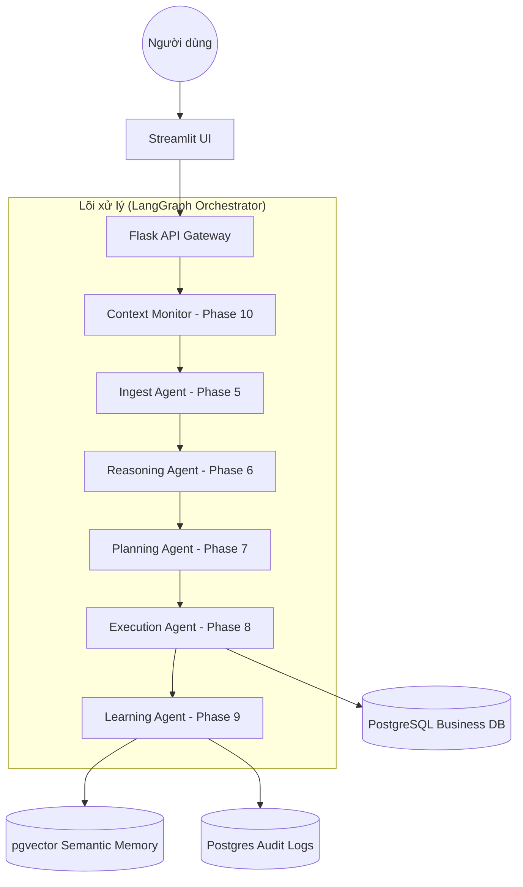
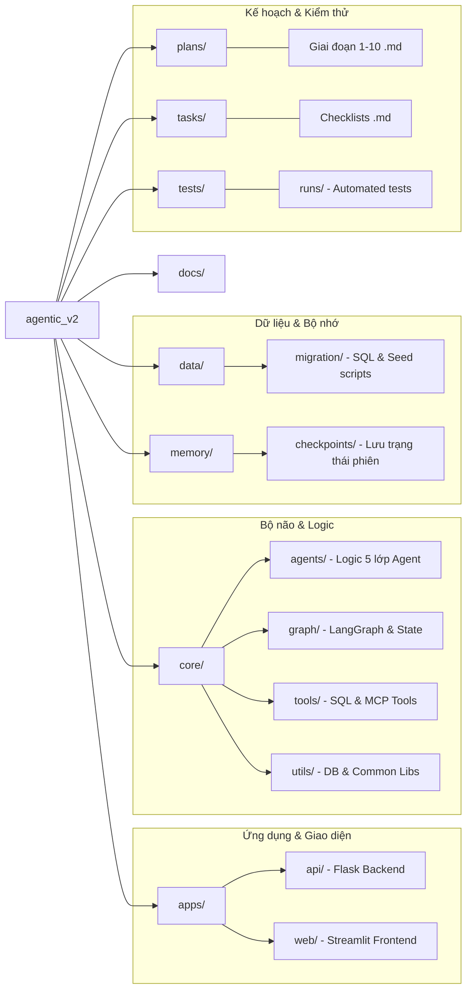

# Kiến trúc & Luồng xử lý (Architecture & Flow)

## 🏗️ Kiến trúc Tổng thể
Hệ thống được xây dựng theo mô hình **Agentic Workflow** sử dụng **LangGraph** để quản lý trạng thái và luồng tư duy.

### 1. Sơ đồ Luồng Công việc (Logical Flow)

---

## 📂 Cấu trúc Thư mục Chi tiết (Project Structure)

Dưới đây là sơ đồ phân cấp thư mục và vai trò của từng thành phần:

### Chi tiết các thư mục chính:
- **`apps/api/app.py`**: Điểm tiếp nhận yêu cầu từ Frontend, điều phối vào LangGraph.
- **`apps/web/ui.py`**: Giao diện người dùng với tính năng hiển thị tư duy Agent (Trace).
- **`core/graph/builder.py`**: Nơi xây dựng "đồ thị" tư duy, kết nối các Node (Agent).
- **`core/graph/state.py`**: Định nghĩa dữ liệu truyền đi giữa các bước xử lý.
- **`core/utils/db.py`**: Quản lý kết nối Database tập trung.
- **`data/migration/`**: Chứa `db.json` và các script khởi tạo dữ liệu nghiệp vụ.
- **`memory/checkpoints/`**: Nơi lưu giữ "ký ức" ngắn hạn của phiên hội thoại (để hiểu "nó", "họ"...).

---

## 🔄 Quy trình Xử lý một Câu hỏi (Detailed Step-by-Step)
1.  **Request**: Người dùng nhập câu hỏi vào Streamlit.
2.  **API Entry**: Flask nhận request, tạo `thread_id` và gọi LangGraph.
3.  **Context Monitoring**: Kiểm tra câu hỏi có liên quan đến hội thoại trước không.
4.  **Multi-Agent Reasoning**:
    -   `Ingest`: Làm sạch và định danh ý định.
    -   `Reasoning`: Trích xuất thực thể (Khách hàng, mốc thời gian).
    -   `Planning`: Lập trình trình tự truy vấn.
    -   `Execution`: Chuyển kế hoạch thành SQL và lấy kết quả từ Postgres.
    -   `Learning`: Rút trích kinh nghiệm từ kết quả vừa thực thi.
5.  **Response**: Trả kết quả kèm theo toàn bộ **Trace Log** về UI để hiển thị.
6.  **Persistence**: Lưu toàn bộ vết xử lý vào bảng Audit để quản trị.
