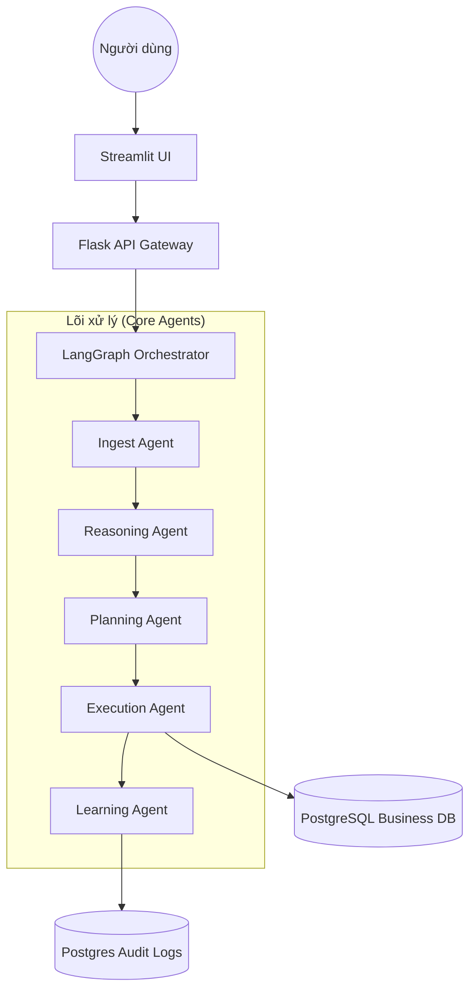

# Kiến trúc & Luồng xử lý (Architecture & Flow)

## 🏗️ Kiến trúc Tổng thể
Hệ thống được xây dựng theo mô hình **Agentic Workflow** sử dụng **LangGraph** để quản lý trạng thái và luồng tư duy.

### Sơ đồ Luồng (Sequence Flow)

## 📂 Cấu trúc Thư mục (Directory Structure)
Dự án được phân bổ khoa học để dễ dàng mở rộng:

-   `apps/`: Chứa các ứng dụng đầu cuối.
    -   `api/`: Backend Flask - "Cổng vào" của hệ thống.
    -   `web/`: Frontend Streamlit - "Giao diện" tương tác.
-   `core/`: Trái tim của hệ thống.
    -   `graph/`: Định nghĩa luồng LangGraph và trạng thái (State).
    -   `agents/`: Logic cụ thể của từng Agent (sẽ triển khai ở các phase sau).
    -   `utils/`: Các công cụ dùng chung (Kết nối DB, Logging).
-   `data/`: Quản lý dữ liệu.
    -   `migration/`: Các script tạo cấu trúc bảng và đổ dữ liệu mẫu (Seeding).
-   `docs/`: Tài liệu hướng dẫn và kiến trúc (Thư mục bạn đang xem).
-   `plans/`: Kế hoạch chi tiết cho từng giai đoạn phát triển (Phase 1-10).
-   `tasks/`: Danh sách các công việc cần làm (Checklist).
-   `tests/`: Bộ kiểm thử tự động để đảm bảo chất lượng.

## 🔄 Quy trình Xử lý một Câu hỏi
1.  **Request**: Người dùng gửi câu hỏi từ UI.
2.  **Context**: `ContextMonitor` (Phase 10) phân tích xem câu hỏi có liên quan đến lịch sử không.
3.  **Think**: Các Agent phân tích thực thể, lập kế hoạch truy vấn SQL.
4.  **Execute**: Thực thi SQL an toàn thông qua Tool Layer (Phase 4).
5.  **Trace**: Toàn bộ quá trình được đẩy ngược lại UI để hiển thị cho người dùng theo thời gian thực.
6.  **Audit**: Lưu vết vào Database để phục vụ giám sát và học tập.
