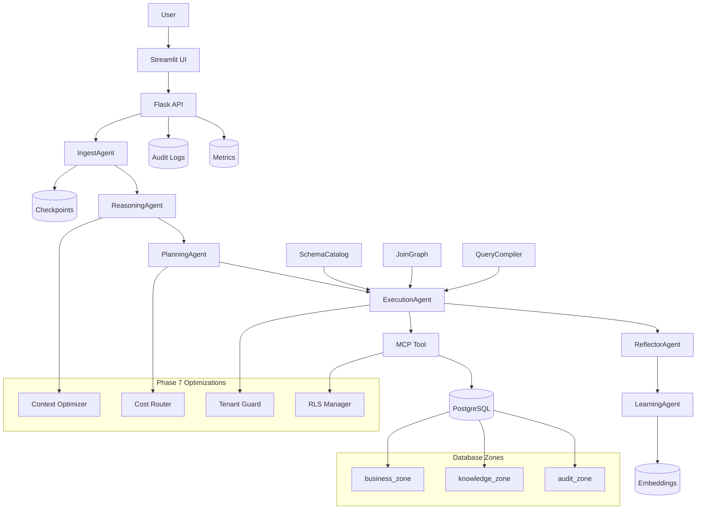

# Tổng kết Hệ thống Agentic AI

## Tổng quan Dự án

Hệ thống **Agentic CRM Intelligence System** là một nền tảng AI đa tầng được thiết kế để cung cấp khả năng truy vấn và phân tích dữ liệu CRM một cách thông minh, an toàn và có khả năng tự học. Dự án được phát triển qua 8 phase chuyên sâu, từ nền móng cơ sở hạ tầng đến việc hoàn thiện và vận hành production.

### Mục tiêu Chính
- **Traceable UI**: Theo dõi chain-of-thought của Agent theo thời gian thực.
- **Context Awareness**: Hiểu ngữ cảnh hội thoại nhiều lượt.
- **Secure Execution**: Thực thi SQL an toàn thông qua lớp bảo mật RBAC và Tool Layer.
- **Dynamic Query Engine**: Dùng schema catalog, join graph và QueryPlan compiler để giảm context gửi vào LLM, thay vì để LLM tự viết toàn bộ SQL.
- **Self-Learning**: Ghi nhớ pattern thành công để tối ưu hóa chi phí và tốc độ.

### Công nghệ Sử dụng
- **Backend**: Python, Flask API
- **Frontend**: Streamlit UI
- **Database**: PostgreSQL với pgvector và semantic schema
- **AI Orchestration**: LangGraph, LiteLLM Router
- **Security**: MCP Tool, RBAC, Audit Logging

---

## Các Phase Đã Hoàn Thành

### Phase 1: Infrastructure & Data Foundation
- Thiết lập cấu trúc thư mục chuẩn.
- Khởi tạo PostgreSQL schema với zones: `business_zone`, `knowledge_zone`, `audit_zone`.
- Migration strategy từ Dataverse.
- Semantic views AI-friendly (ví dụ `v_hbl_accounts`, `v_hbl_contacts`).

### Phase 2: UI, API Gateway & Observability
- Flask API với endpoints `/health`, `/ready`, `/v1/agent/chat`, `/v1/agent/trace`.
- Streamlit UI cho chat và hiển thị trace.
- Audit logging vào `audit_zone.agent_logs`.

### Phase 3: MCP, LLM Orchestration & Secure Tooling
- MCP Tool cho SQL execution an toàn (deny-by-default).
- LiteLLM Router với fallback model.
- Semantic schema retrieval chỉ inject schema liên quan.
- Security policy và log redaction.

### Phase 4: Ingest Layer & Context Nexus
- IngestAgent: normalize prompt, extract intent/entity, chống injection.
- Checkpoint persistence vào `audit_zone.checkpoints`.
- Thread isolation và resume/replay.

### Phase 5: Reasoning & Planning Layers
- ReasoningAgent: phân rã vấn đề, output JSON structured.
- PlanningAgent: tạo task queue với dependency.
- Tích hợp LangGraph runtime.

### Phase 6: Execution, Reflection & Continuous Learning
- ExecutionAgent: thực thi SQL từ plan.
- Dynamic query path: task được chuyển thành `QueryPlan`, validate bảng/cột bằng `SchemaCatalog`, rồi compile SQL trước khi gọi MCP.
- ReflectorAgent: đánh giá kết quả, quyết định retry.
- LearningAgent: lưu pattern vào `knowledge_zone.agent_embeddings`.

### Phase 7: Lean Optimization & Scalability
- Context optimizer: pruning schema, summarization history.
- Cost-aware routing: chọn model theo complexity.
- Tenant guard và RLS manager.
- Metrics logging vào `audit_zone.api_metrics`.

### Phase 8: Finalization, Governance & Project Closure
- Deployment scripts: `scripts/deploy.py`, `scripts/backup.py`, `scripts/monitor.py`.
- Runbooks: rollback, incident response, recovery.
- Documentation: `docs/deployment/`, production checklist.
- Governance và handover docs.

---

## Cấu trúc Thư mục

```
agentic_v2/
├── apps/                    # Giao diện người dùng
│   ├── api/                 # Flask API backend
│   │   └── app.py           # Main API application
│   └── web/                 # Streamlit UI
│       └── streamlit_app.py # Main UI application
├── core/                    # Trái tim hệ thống
│   ├── agents/              # Các Agent layers
│   │   ├── ingest_agent.py
│   │   ├── reasoning_agent.py
│   │   ├── planning_agent.py
│   │   ├── execution_agent.py
│   │   ├── reflector_agent.py
│   │   └── learning_agent.py
│   ├── graph/               # LangGraph runtime
│   │   └── langgraph_runtime.py
│   ├── query/               # Dynamic query engine
│   │   ├── catalog.py       # DB metadata catalog + fallback cards
│   │   ├── join_graph.py    # FK/join path discovery
│   │   ├── query_plan.py    # Structured QueryPlan contracts
│   │   ├── compiler.py      # Validated SQL renderer
│   │   └── planner.py       # Intent-to-QueryPlan bridge
│   ├── tools/               # Tools và utilities
│   │   ├── llm_router.py    # Model routing
│   │   ├── mcp_tool.py      # SQL execution tool
│   │   ├── semantic_schema.py # Schema retrieval
│   │   └── security.py      # Security policies
│   └── utils/               # Utilities
│       ├── infra/           # Infrastructure helpers
│       │   ├── audit.py
│       │   ├── checkpoint.py
│       │   ├── db.py
│       │   └── metrics.py
│       └── logic/           # Phase 7 logic modules
│           ├── context_optimizer.py
│           ├── cost_router.py
│           ├── tenant_guard.py
│           └── rls_manager.py
├── data/                    # Database schemas và migrations
│   ├── schema/
│   │   └── init.sql         # PostgreSQL schema init
│   └── backups/             # Backup files (tạo bởi scripts)
├── docs/                    # Documentation
│   ├── phase_1_setup.md     # Phase docs
│   ├── ...
│   ├── phase_8_setup.md
│   ├── deployment/          # Deployment docs
│   │   ├── README.md
│   │   └── production_checklist.md
│   └── system_summary.md    # This file
├── plans/                   # Phase plans
│   ├── phase_1_architecture.md
│   ├── ...
│   └── phase_8_execution_agent.md
├── runbooks/                # Operational runbooks
│   ├── rollback.md
│   ├── incident_response.md
│   └── recovery.md
├── scripts/                 # Operational scripts
│   ├── init_db.py           # DB initialization
│   ├── deploy.py            # Deployment
│   ├── backup.py            # Backup
│   └── monitor.py           # Health monitoring
├── tasks/                   # Task management
│   └── MASTER_PHASE_ROADMAP_TODO.md
├── tests/                   # Tests (future)
├── .env                     # Environment variables
├── .env.example             # Example env
├── docker-compose.yml       # Docker setup
├── README.md                # Project README
├── requirements.txt         # Python dependencies
└── run.py                   # Startup script
```

---

## Sơ đồ Kiến trúc Hệ thống



### Giải thích Sơ đồ

- **User Flow**: User → UI → API → Agents Pipeline → DB
- **Agent Pipeline**: Ingest → Reasoning → Planning → Execution → Reflection → Learning
- **Dynamic Query Path**: ExecutionAgent → SchemaCatalog/JoinGraph → QueryPlan → QueryCompiler → MCP Tool
- **Tools**: MCP Tool cho SQL execution an toàn
- **Optimizations (Phase 7)**: Context pruning, cost routing, tenant isolation
- **Persistence**: Checkpoints, Audit Logs, Metrics, Embeddings
- **Database**: Chia zones cho business, knowledge, audit

---

## Cách Chạy và Deploy

### Development Setup
1. Clone repo và cài dependencies: `pip install -r requirements.txt`
2. Khởi tạo DB: `python scripts/init_db.py`
3. Chạy API: `python run.py api`
4. Chạy UI: `python run.py ui` (terminal khác)

### Production Deploy
1. Sử dụng `scripts/deploy.py` để deploy
2. Backup DB trước: `python scripts/backup.py`
3. Monitor health: `python scripts/monitor.py`
4. Tham khảo `docs/deployment/README.md` và runbooks

### API Endpoints
- `GET /health`: Health check
- `GET /ready`: Readiness check
- `POST /v1/agent/chat`: Chat với agent
- `GET /v1/agent/trace/<thread_id>`: Trace events
- `GET /v1/agent/checkpoints/<thread_id>`: List checkpoints

---

*Tài liệu tổng kết này được tạo tự động dựa trên codebase hiện tại. Cập nhật khi có thay đổi.*
