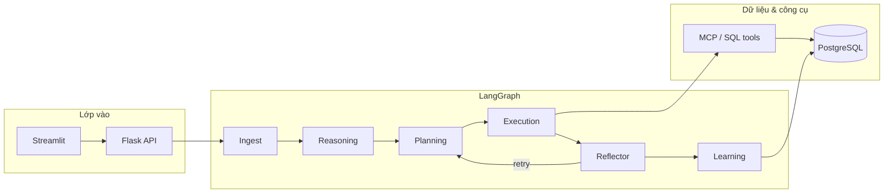

# Cấu trúc đích của dự án (Target Architecture)

*Baseline kiến trúc — nguồn: `plans/phase_*.md` (Phase 1–8) và cấu trúc mã nguồn hiện tại.*

Tài liệu này hợp nhất **tầm nhìn kiến trúc** trong thư mục `plans/` (Phase 1–8) với **bố cục mã nguồn thực tế**, làm mốc thống nhất cho phát triển, review và bàn giao.

> **Ghi chú đặt tên file:** một số file plan lệch số so với *tiêu đề nội dung* (ví dụ `phase_5_ingest_agent.md` mô tả *Reasoning & Planning*). Khi tham chiếu luôn ưu tiên **tiêu đề trong file** làm ngữ nghĩa phase.

---

## 1. Tóm tắt điều hành

| Thành phần | Vai trò |
|------------|---------|
| **PostgreSQL** | Nguồn dữ liệu nghiệp vụ, vector/RAG, audit |
| **LangGraph** | Điều phối pipeline đa-agent, checkpoint |
| **LiteLLM / Router** | Đa model, fallback, chi phí |
| **Flask API** | Cổng REST, session, kích hoạt graph |
| **Streamlit** | UI nội bộ, chat, trace |
| **MCP & Tools** | Truy cập DB/schema có kiểm soát, mở rộng công cụ |

---

## 2. Lộ trình năng lực theo phase (plans/)

| Phase (file) | Tiêu đề nội dung | Năng lực chính |
|--------------|-----------------|----------------|
| 1 | Infrastructure & Data Foundation | Thư mục chuẩn, stack, semantic layer, migration |
| 2 | UI, API Gateway & Observability | Flask + Streamlit, audit/execution log |
| 3 | MCP, LLM Orchestration & Secure Tooling | MCP, router, schema retrieval, policy |
| 4 | Ingest Layer & Context Nexus | Ingest gateway, security, Context Nexus |
| 5 | Reasoning & Planning | ReasoningAgent, PlanningAgent, BabyAGI-style plan |
| 6 | Execution, Reflection & Continuous Learning | Execution, Reflector, learning loop |
| 7 | Lean Optimization & Scalability | Nén context, cost routing, RLS, multi-tenant |
| 8 | Finalization, Governance & Closure | Hardening, RBAC, deploy, docs, handover |

---

## 3. Luồng xử lý tổng thể (logical)



---

## 4. Cấu trúc thư mục đích (hybrid: plan + thực tế)

### 4.1 Cây mục tiêu (production-oriented)

Kế thừa Phase 1 & Phase 13 (plan Phase 8), đồng bộ với code hiện có:

```text
project-root/
├── apps/
│   ├── api/                 # Flask — gateway, /v1/agent/chat, health, trace
│   └── web/                 # Streamlit — chat, cockpit, debug
│
├── core/
│   ├── agents/              # Ingest, Reasoning, Planning, Execution, Reflector, Learning, RAG, Commander…
│   ├── graph/               # LangGraph builder, state, graph settings
│   ├── prompts/             # Modular prompts, security rules
│   ├── schemas/             # Pydantic contracts cho reasoning/planning handoff
│   ├── tools/               # db/, mcp/, context/, formatters/, registry…
│   ├── monitor/             # Observability UI helpers (cockpit)
│   ├── models.py            # AgentState & shared types
│   └── utils/
│       ├── infra/           # db, security, observability, cache, queue…
│       └── logic/           # router, budget, token, model dispatch…
│
├── data/
│   ├── schema/              # init.sql, extensions, zones (business / knowledge / audit)
│   ├── migration/           # seed, metadata, Dataverse sync (theo roadmap)
│   └── backups/             # [đích] snapshot / dump policy
│
├── plans/                   # Đặc tả theo phase (source cho roadmap)
├── tasks/                   # To-do, kiến trúc tóm tắt, checklist vận hành
├── tests/                   # unit / integration / runs (mở rộng theo Phase 8)
│   ├── test_phase5_contracts.py
│   └── test_phase6_retry_policy.py
├── scripts/                 # init DB, verify, deploy helpers
├── docs/                    # Kiến trúc, vận hành, bảo mật
├── runbooks/                # [đích] incident, rollback, recovery (Phase 8)
│
├── run.py                   # Khởi chạy API + UI (dev)
├── requirements.txt
├── .env / .env.example      # [đích] mẫu biến môi trường đầy đủ
└── docker-compose.yml       # [đích] Postgres + dịch vụ phụ trợ
```

### 4.2 Phân vùng dữ liệu (PostgreSQL)

| Schema / zone | Mục đích |
|---------------|----------|
| `business_zone` / bảng CRM | Dữ liệu nghiệp vụ (ví dụ `hbl_account`) |
| `knowledge_zone` | Pattern query, embedding, học lặp |
| `audit_zone` | `agent_logs`, trace, feedback (tuân Phase 2 & 15+) |

### 4.3 Hạ tầng chưa tách hẳn khỏi `core/` (roadmap gộp Phase 7–8)

Các module sau có thể tách dần thành package riêng khi ổn định:

- `core/utils/logic/` → tương đương **routing**, **optimization** (cost, complexity).
- `core/monitor/` + `core/utils/infra/observability.py` → **observability cockpit**.
- Tiền đề **learning** nằm ở `agents/learning_agent.py` + `knowledge_zone`.

---

## 5. Ràng buộc phi chức năng (từ Phase 7–8)

- **Bảo mật:** least privilege DB user cho agent; chỉ SELECT đã kiểm; không lộ secret trong log.
- **Quan sát:** mọi request quan trọng có trace có cấu trúc; latency có thể đo theo pipeline.
- **Sẵn sàng vận hành:** tài liệu deploy, backup, handover; tách môi trường dev/staging/prod.

---

## 6. Độ lệch so với “đích tuyệt đối” (để theo dõi)

| Hạng mục | Trạng thái đích |
|----------|-----------------|
| `runbooks/` | Tạo theo Phase 8 khi triển khai production |
| `tests/unit` vs `tests/integration` | Tách cấu trúc khi số lượng test tăng |
| `data/backups/` | Gắn policy backup DB |
| RLS multi-tenant toàn bảng | Theo Phase 7 — áp dụng dần trên schema nghiệp vụ |
| Alembic | Phase 1 đề cập — có thể bổ sung thay cho chỉ `init.sql` |

### 6.1 Cập nhật triển khai mới (đã hoàn thành)

- Bổ sung contract schema ở `core/schemas/agent_contracts.py` để chuẩn hóa output Reasoning/Planning.
- Runtime hỗ trợ retry/backoff + phân loại lỗi + DLQ record trong `core/graph/langgraph_runtime.py`.
- UI cập nhật khối realtime state trong `apps/web/streamlit_app.py` để hiển thị state theo vòng đời agent.
- Test xác nhận contract/retry tại `tests/test_phase5_contracts.py` và `tests/test_phase6_retry_policy.py`.

---

## 7. Tham chiếu nội bộ

- Đặc tả chi tiết từng phase: `plans/phase_1_architecture.md` … `plans/phase_8_execution_agent.md`
- Việc cần làm theo thứ tự: `tasks/MASTER_PHASE_ROADMAP_TODO.md`
