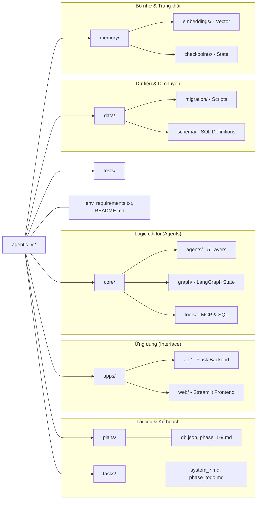

# Sơ đồ Cấu trúc Dự án (Project Structure Diagram)

Dưới đây là sơ đồ phân cấp thư mục và vai trò của từng thành phần trong dự án:

## Chi tiết các thư mục chính
- **`plans/`**: Lưu trữ các file kế hoạch chi tiết và thông số kỹ thuật cho từng giai đoạn phát triển.
- **`tasks/`**: Chứa các file mô tả hệ thống, kiến trúc và danh sách công việc (to-do) đã được chuẩn hóa.
- **`apps/`**: Nơi chứa mã nguồn của giao diện người dùng và API server.
- **`core/`**: Trái tim của hệ thống, nơi định nghĩa các Agent, luồng xử lý LangGraph và các công cụ thực thi.
- **`data/`**: Quản lý việc di chuyển dữ liệu từ hệ thống cũ và định nghĩa cấu trúc database mới.
- **`memory/`**: Xử lý các hoạt động liên quan đến bộ nhớ vector và lưu trữ trạng thái phiên làm việc.
- **`tests/`**: Chứa các kịch bản kiểm thử cho từng thành phần của hệ thống.
