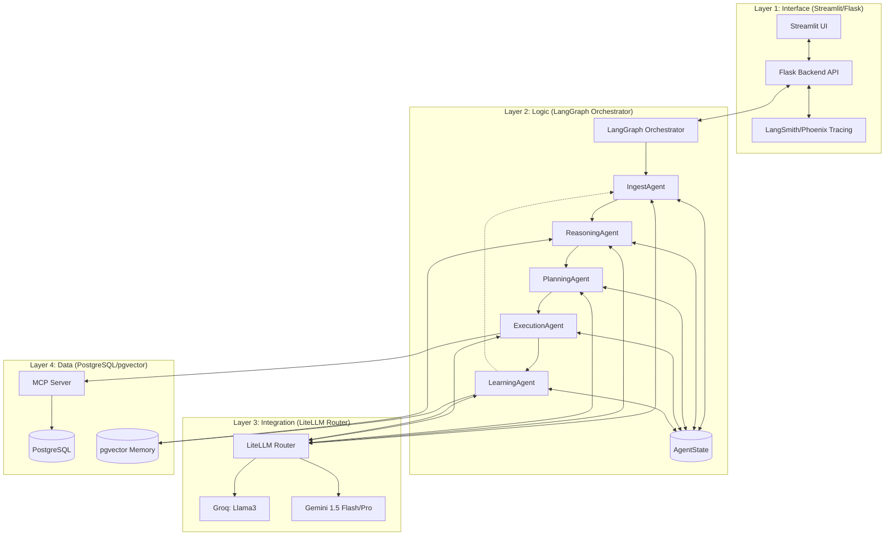
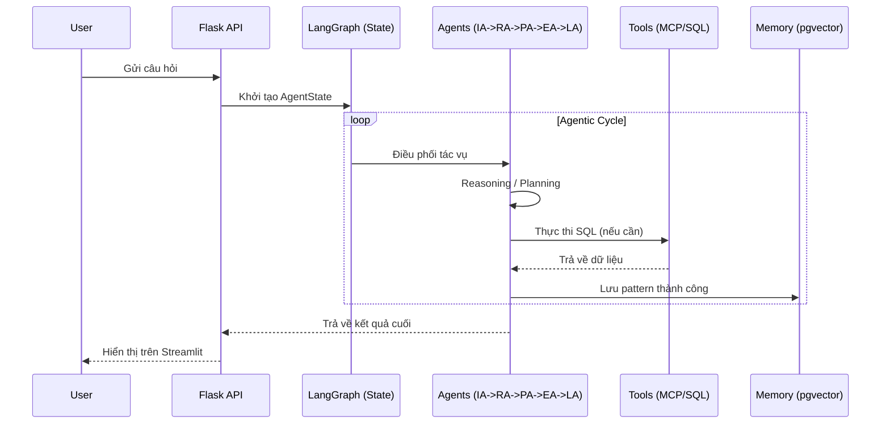

# Cấu trúc Hệ thống (System Architecture)

## 1. Sơ đồ Kiến trúc Tổng thể

## 2. Các lớp Kiến trúc (Layered Design)

### Layer 1: Interface Layer (UI/API)
- **Frontend**: Streamlit Dashboard hiển thị chat interface và realtime trace visualization.
- **Backend API**: Flask API quản lý session, thread của LangGraph và streaming logs.
- **Tracing**: Tích hợp LangSmith/Phoenix để giám sát hiệu năng và debug graph.

### Layer 2: Logic Layer (Agentic Framework)
- Sử dụng **LangGraph** để điều phối 5 lớp Agent:
    - **IngestAgent**: Xử lý đầu vào và bảo mật.
    - **ReasoningAgent**: Suy luận logic CoT.
    - **PlanningAgent**: Lập kế hoạch theo pattern BabyAGI.
    - **ExecutionAgent**: Thực thi hành động và gọi công cụ.
    - **LearningAgent**: Tối ưu hóa và ghi nhớ dài hạn.

### Layer 3: Integration Layer (Multi-Model Router)
- **LiteLLM**: Router điều phối giữa các nhà cung cấp LLM khác nhau.
- **Model Routing Strategy**:
    - **Fast Path (Groq)**: Dùng cho Reasoning và Execution (ưu tiên latency thấp).
    - **Deep Path (Gemini/OpenRouter)**: Dùng cho Ingest và Learning (ưu tiên ngữ cảnh lớn và phân tích sâu).

### Layer 4: Data Layer (Persistence)
- **PostgreSQL**: Lưu trữ dữ liệu nghiệp vụ, trạng thái Agent và Audit logs.
- **pgvector**: Lưu trữ embedding cho bộ nhớ ngữ nghĩa (Semantic Memory).
- **MCP Server (Model Context Protocol)**: Lớp trung gian an toàn giữa AI và cơ sở dữ liệu, chuẩn hóa công cụ và ngăn chặn truy cập trái phép.

## 3. Quy trình Dòng dữ liệu (Data Flow)

1. **User Input** → Flask API.
2. **LangGraph Orchestrator** khởi tạo `AgentState`.
3. **IngestAgent** validate và classify intent.
4. **ReasoningAgent** bẻ nhỏ bài toán.
5. **PlanningAgent** lập danh sách task.
6. **ExecutionAgent** thực thi SQL thông qua MCP Tools.
7. **LearningAgent** lưu trữ pattern thành công.
8. **Final Response** trả về cho người dùng qua Streamlit UI.

## 5. Cấu trúc Thư mục Dự án
Xem chi tiết sơ đồ cấu trúc tại: [project_structure.md](project_structure.md)

## 6. Bảo mật (Security by Design)
- **RBAC**: AI sử dụng role hạn chế, chỉ có quyền `SELECT` trên các bảng nghiệp vụ.
- **Prompt Hardening**: Chống Injection và Jailbreak tại tầng Ingest.
- **Audit Logging**: Ghi lại mọi câu lệnh SQL do Agent tạo ra để hậu kiểm.
