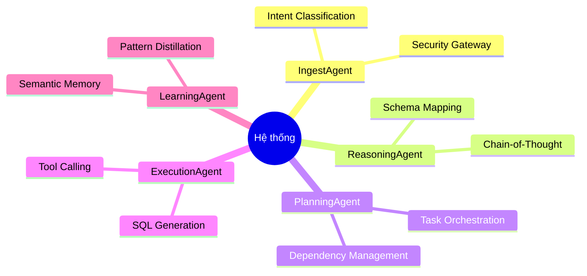

# Mô tả Hệ thống: Autonomous CRM Intelligence System

Hệ thống **Autonomous CRM Intelligence System** là một nền tảng Agentic AI tiên tiến, được thiết kế để tương tác thông minh với dữ liệu CRM trong PostgreSQL thông qua ngôn ngữ tự nhiên. Hệ thống không chỉ đơn thuần là một chatbot, mà là một tập hợp các Agent chuyên biệt phối hợp với nhau để hiểu, lập kế hoạch, thực thi và học hỏi từ các truy vấn của người dùng.

## Mục tiêu chính
- **Multi-Agent Orchestration**: Điều phối quy trình làm việc giữa các Agent chuyên biệt.
- **Stateful Reasoning**: Duy trì ngữ cảnh và trạng thái xuyên suốt quá trình xử lý.
- **Tool-driven Execution**: Thực thi các tác vụ thông qua hệ thống công cụ an toàn (MCP).
- **Long-term Memory**: Ghi nhớ và tái sử dụng tri thức từ các phiên làm việc trước.
- **Secure Interaction**: Tương tác an toàn với cơ sở dữ liệu PostgreSQL.

## Quy trình Agentic Loop

## Các lớp Agent cốt lõi (5-Layer Architecture)
1. **IngestAgent (The Gatekeeper)**: Tiếp nhận yêu cầu, phân loại ý định (intent), trích xuất thực thể (entities) và kiểm tra bảo mật bước đầu.
2. **ReasoningAgent (The Thinker)**: Phân tích logic, chia nhỏ bài toán phức tạp thành các bước suy luận CoT (Chain-of-Thought) và xác định các mối quan hệ dữ liệu.
3. **PlanningAgent (The Task Orchestrator)**: Xây dựng lộ trình thực thi (roadmap) chi tiết, quản lý sự phụ thuộc giữa các tác vụ và điều chỉnh kế hoạch linh hoạt khi có lỗi.
4. **ExecutionAgent (The Doer)**: Biến kế hoạch thành hành động thực tế, tự động sinh mã SQL (thông qua Groq/Llama3) và thực thi truy vấn an toàn.
5. **LearningAgent (The Scholar)**: Quan sát kết quả thành công, trích xuất các mẫu (patterns), vector hóa và lưu trữ vào bộ nhớ dài hạn (pgvector) để tối ưu hóa cho các lần sau.

## Giá trị mang lại
- **Tự động hóa hoàn toàn**: Từ việc hiểu câu hỏi đến việc thực thi và sửa lỗi.
- **Tính minh bạch (Observability)**: Người dùng có thể theo dõi từng bước tư duy của Agent thông qua giao diện Trace Log.
- **Khả năng tự học**: Hệ thống càng sử dụng càng trở nên thông minh và hiệu quả hơn, giảm chi phí gọi LLM nhờ cơ chế Semantic Cache.
- **Bảo mật tuyệt đối**: AI không truy cập trực tiếp vào Database mà thông qua lớp MCP và RBAC nghiêm ngặt.
